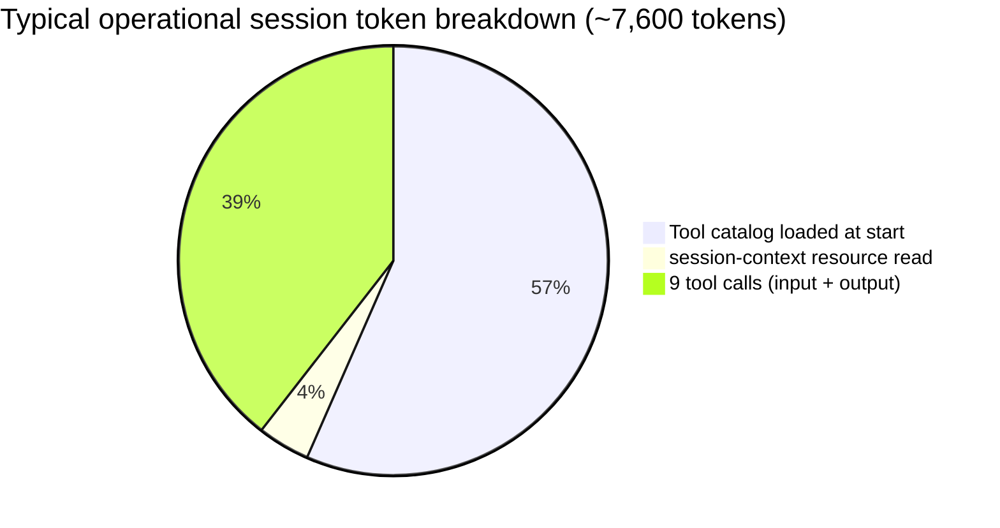
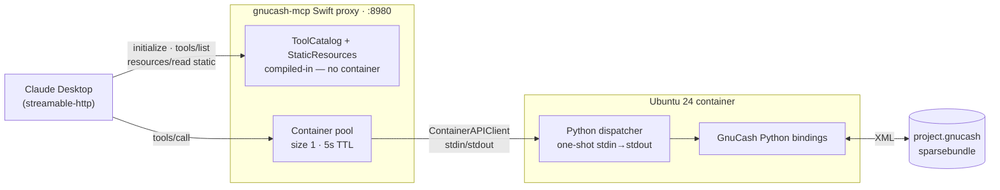
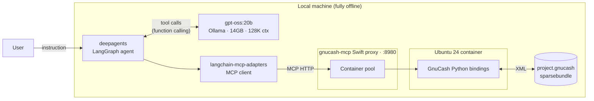
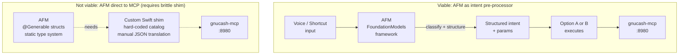
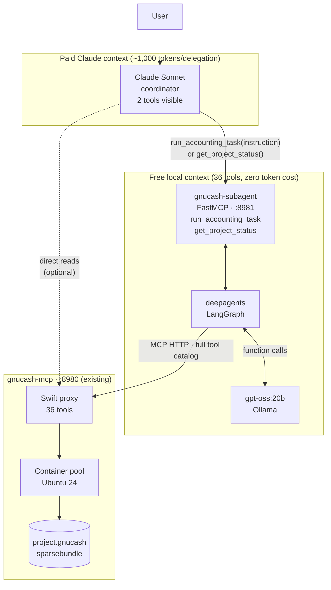
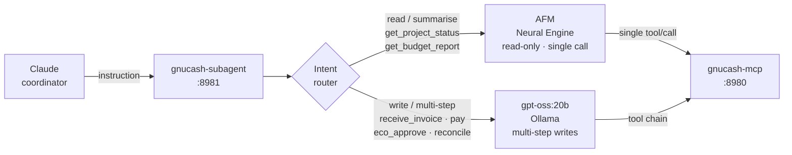
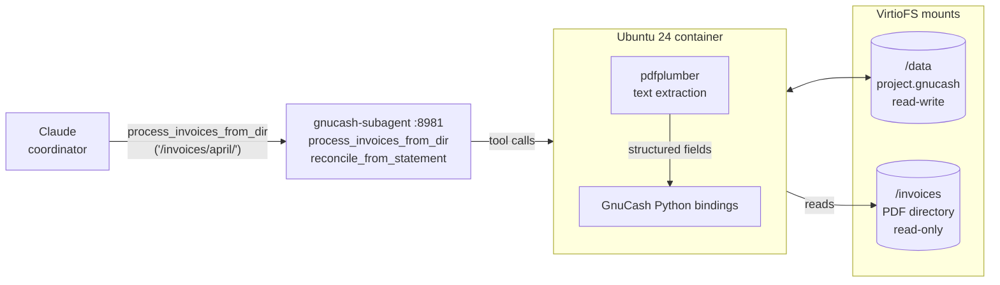
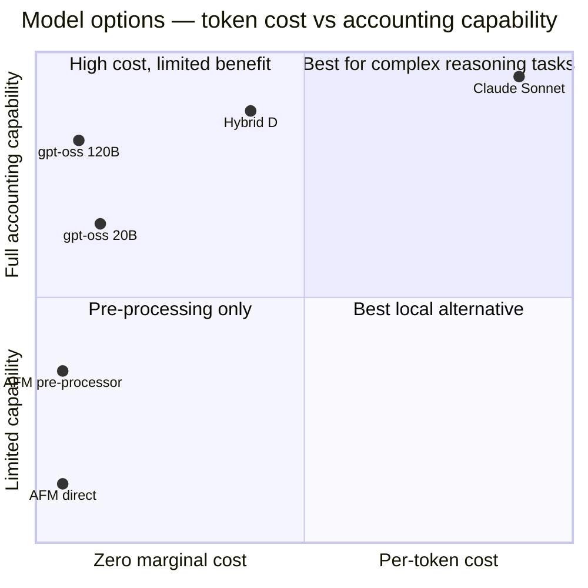

# Appendix E — Model Options and Client Architectures

The gnucash-mcp server speaks standard MCP over streamable HTTP on `localhost:8980`.
Any MCP client that supports this transport can connect. This appendix covers the
practical options, their cost and capability trade-offs, and a hybrid architecture
where Claude acts as a coordinator that delegates the tool-heavy accounting loop to
a free local model.

---

## Token cost baseline

Before comparing options, establish what a session actually costs in tokens.

**Tool catalog loaded at session start (`full` profile):**

| Profile | Tools advertised | Approx tokens |
|---|---|---|
| `full` | 36 tools | ~8,000 |
| `operational` | 16 tools | ~4,300 |
| `readonly` | 6 tools | ~1,500 |
| `construction` | 21 tools | ~5,800 |

**Per tool call (rough):**

| Event | Approx tokens |
|---|---|
| `gnucash://session-context` read + response | ~300 |
| Single write tool call + response | ~200–400 |
| Read tool with full transaction list | ~400–800 |

**Typical session — 10 tool calls, `operational` profile:**

```
Tool catalog:          ~4,300 tokens (input, once)
gnucash://session-context read: ~300 tokens
9 × tool calls:        ~3,000 tokens (mixed input/output)
Total:                 ~7,600 tokens per session
```



Only Claude charges per token. Ollama (gpt-oss) and Apple Foundation Model (AFM)
have zero per-token cost — the only cost is electricity and time.

---

## Option A — Claude (recommended baseline)

**Claude Desktop (`streamable-http`) or Claude API + MCP SDK**

Claude is the reference client this server is designed for. `server_instructions`,
`gnucash://session-context`, the three-tier tool architecture, and the profile system are
all designed around Claude's behaviour.

**Cost at Sonnet 4.x pricing (~$3/MTok input, ~$15/MTok output):**

| Session type | Approx tokens | Approx cost |
|---|---|---|
| Light read session (3 tool calls) | ~5,500 | ~$0.02 |
| Typical operational session (10 calls) | ~7,600 | ~$0.04 |
| Heavy setup session (25 calls, `full` profile) | ~20,000 | ~$0.12 |

For a construction project with one or two Claude sessions per week, annual cost is
well under $50. This is low enough that token cost should not drive architecture
decisions unless session frequency is very high.



**Strengths:**
- Native MCP support — no adapter layer
- Reads `server_instructions` and respects tool tiering
- Best multi-step accounting reasoning
- CoWork support via SDK bridge (MC-4)
- `gnucash://session-context` read reliability highest (still uncertain — KU-10)

**Weaknesses:**
- Per-token cost (small but non-zero)
- Requires network (Anthropic API or Claude Desktop)
- Not suitable for offline use

---

## Option B — gpt-oss:20b via Ollama + deepagents (fully local)

**Stack:** `gpt-oss:20b` (Ollama) → deepagents (LangGraph) →
`langchain-mcp-adapters` → `localhost:8980`

gpt-oss:20b is an OpenAI open-weight model (Apache 2.0): 128K context, native
function calling, chain-of-thought reasoning, MXFP4 quantized to 14GB. deepagents
is a LangGraph-based agent harness with built-in MCP support via
`langchain-mcp-adapters`.

**Cost:** Zero per token. Power draw while inferring (~30–60W on M-series GPU).

**Setup sketch:**

```python
from langchain_ollama import ChatOllama
from langchain_mcp_adapters.client import MultiServerMCPClient
from deepagents import create_agent

llm = ChatOllama(model="gpt-oss:20b", temperature=0)

async with MultiServerMCPClient({
    "gnucash": {
        "url": "http://localhost:8980/mcp",
        "transport": "streamable_http",
    }
}) as mcp_client:
    tools = mcp_client.get_tools()
    agent = create_agent(llm, tools)
    result = await agent.ainvoke({"messages": [("user", "What is the current AP balance?")]})
```



**Configuration notes:**

- Start the proxy with `gnucash-mcp start --profile operational` to reduce the
  tool catalog to ~4,300 tokens — gpt-oss handles this fine but fewer tools means
  fewer wrong choices.
- Explicitly fetch `gnucash://session-context` at session start; deepagents won't
  read resources automatically. Add it as a hardcoded first step in the LangGraph
  graph or inject its content into the system prompt.
- Disable deepagents' built-in `execute` / `write_file` tools or constrain the
  sandbox so they cannot reach `/Volumes/GnuCash-Project` directly.
- `Mcp-Session-Id` header forwarding by `langchain-mcp-adapters` is unconfirmed —
  test whether the proxy's TTL pool works correctly for multi-step sessions.

**Hardware requirement:** 14GB unified memory headroom above the OS and other
applications. Comfortable on M2/M3 Max (96GB) or Pro (32GB+ with other apps closed).
The 120B variant (65GB) requires an Ultra-class machine but offers reasoning closer
to Claude Sonnet.

**Strengths:**
- Fully offline and air-gapped capable
- Zero marginal cost per session
- 128K context — no session length pressure
- Native function calling — handles tool schemas correctly
- Chain-of-thought inspectable

**Weaknesses:**
- deepagents does not read `server_instructions` — tool guidance must be in the
  system prompt
- Accounting reasoning weaker than Claude for edge cases (void vs delete,
  correct account path selection, ECO direction semantics)
- No CoWork integration
- Requires local hardware with sufficient RAM

---

## Option C — Apple Foundation Model (AFM)

**On-device inference via `FoundationModels` framework (macOS 26+)**

AFM is Apple's on-device model powering Apple Intelligence. It runs entirely
on the Neural Engine with no network calls and zero token cost beyond power.

**Why a direct connection is not practical:**

AFM's tool-calling API is statically typed Swift (`@Generable` structs). It does
not speak MCP JSON-RPC. Bridging AFM to this MCP server would require a custom
Swift shim that:
1. Calls `tools/list` at startup and hard-codes tool schemas as Swift structs
2. Translates AFM tool invocations to MCP `tools/call` JSON-RPC requests
3. Parses JSON responses back to typed Swift values for AFM

This is a significant engineering effort and produces a brittle, manually-maintained
catalog that duplicates what the Swift proxy already serves dynamically.

More fundamentally, AFM is a small model (~3B parameters) optimised for Apple
Intelligence tasks: writing assistance, classification, summarisation, on-screen
context. Multi-step double-entry accounting with tool chaining — especially
`eco_approve`, `void_transaction` + re-post workflows, or AP aging analysis — is
outside its design envelope. It will produce plausible-sounding but incorrect
accounting reasoning.

**Where AFM is genuinely useful:**

| Use case | Viable? |
|---|---|
| Natural language → structured params for a single tool call | Yes |
| Classify user intent to choose a tool profile | Yes |
| Summarise a `get_project_summary()` response for display | Yes |
| Multi-step accounting agent (fund → invoice → pay → verify) | No |
| ECO approval workflow with budget impact calculation | No |
| Bank reconciliation with `mark_cleared` loops | No |

The practical role for AFM is as a **lightweight pre-processor or UI layer** —
parsing a voice command or shortcut into a structured request, then passing it to
one of the other options to execute. See the hybrid architecture section below.



---

## Option D — Hybrid: Claude as coordinator, local model as accounting executor

This architecture addresses the core tension: Claude has the best reasoning but
costs tokens; local models are free but weaker. The solution is to split
responsibilities by capability and cost.

### Concept

Claude acts as the **user-facing coordinator** — it understands intent, plans the
work, and summarises results. A separate **subagent MCP server** wraps a local model
(gpt-oss:20b or AFM) and exposes a single high-level tool to Claude:



Claude never sees the 36 gnucash-mcp tool schemas. It only sees one tool:
`run_accounting_task`. The 8,000-token tool catalog loads into the local model's
context (free), not Claude's (paid).

### What Claude pays for

```
System prompt:             ~500 tokens
User message:              ~50–200 tokens
run_accounting_task call:  ~100 tokens (instruction only)
Summary response:          ~200–500 tokens
Total:                     ~850–1,300 tokens per delegation
```

Compared to ~7,600 tokens for a direct Claude session, this is roughly a 6–8×
reduction in Claude token consumption.

### Subagent MCP server interface

The subagent MCP server exposes a small tool catalog to Claude:

```
run_accounting_task(instruction: str) → str
  Execute an accounting task against the GnuCash ledger. The instruction
  should describe what to do in plain English. Returns a plain-text summary
  of what was done and the resulting balances. Examples:
    "Post invoice AAI-103 for $25,000 to Architecture — Acme Architecture,
     dated 2026-03-15, reference AAI-103"
    "What is the current AP balance for all vendors?"
    "Show the last 10 transactions on the project checking account"

get_project_status() → str
  Return a one-paragraph summary of current project financial status:
  funded, spent, open AP, budget variance, and runway estimate.
```

Optionally expose a few more targeted tools for operations where Claude's
reasoning adds value over the local model's:

```
get_budget_report() → str        — structured budget vs actual for Claude to analyse
review_pending_ecos() → str      — list pending ECOs for Claude to recommend action
process_invoices_from_dir(path, dry_run) → str  — extract + post all PDFs in a dir
reconcile_from_statement(pdf_path, account_path, statement_balance, statement_date) → str
```

The PDF tools pass a **path string** to the subagent — no PDF contents enter
Claude's context. Extraction runs inside the container via `pdfplumber` (see
Spike H). Claude pays only ~50 tokens for the path argument regardless of how
many pages the PDFs contain.

### Subagent server implementation sketch

```python
# subagent_mcp/server.py — FastMCP server wrapping deepagents + gnucash-mcp
from mcp.server.fastmcp import FastMCP
from langchain_ollama import ChatOllama
from langchain_mcp_adapters.client import MultiServerMCPClient
from deepagents import create_agent

mcp = FastMCP("gnucash-subagent")
llm = ChatOllama(model="gpt-oss:20b", temperature=0)

@mcp.tool()
async def run_accounting_task(instruction: str) -> str:
    """Execute an accounting task against the GnuCash ledger."""
    async with MultiServerMCPClient({
        "gnucash": {"url": "http://localhost:8980/mcp", "transport": "streamable_http"}
    }) as client:
        tools = client.get_tools()
        agent = create_agent(llm, tools, system_prompt=ACCOUNTING_SYSTEM_PROMPT)
        result = await agent.ainvoke({"messages": [("user", instruction)]})
        return result["messages"][-1].content

@mcp.tool()
async def get_project_status() -> str:
    """Return a one-paragraph project financial status summary."""
    return await run_accounting_task(
        "Read gnucash://session-context then call get_project_summary and return a "
        "concise paragraph summary of the project financial status."
    )

@mcp.tool()
async def process_invoices_from_dir(path: str, dry_run: bool = False) -> str:
    """Extract and post all unprocessed invoice PDFs in a directory.
    PDFs must be text-based (software-generated). dry_run=True validates
    without posting. Returns summary of posted invoices or errors."""
    instruction = (
        f"Extract invoice fields from all PDF files in {path} using pdfplumber. "
        f"For each invoice found, call receive_invoice with the extracted vendor, "
        f"date, amount, invoice_ref, and expense_account. "
        + ("Do not post — report what would be posted." if dry_run else
           "Post each invoice and report results.")
    )
    return await run_accounting_task(instruction)

@mcp.tool()
async def reconcile_from_statement(
    pdf_path: str,
    account_path: str,
    statement_balance: str,
    statement_date: str,
) -> str:
    """Extract transactions from a bank statement PDF and reconcile
    against the named account. Returns unmatched items for review."""
    instruction = (
        f"Extract all transactions from the bank statement PDF at {pdf_path} "
        f"using pdfplumber. Then call reconcile_account('{account_path}', "
        f"'{statement_balance}', '{statement_date}') and mark_cleared for each "
        f"matching transaction. Return a list of any unmatched items."
    )
    return await run_accounting_task(instruction)

ACCOUNTING_SYSTEM_PROMPT = """
You are a GnuCash accounting agent for a construction project ledger.
Always read gnucash://session-context first to load tool groups and conventions.
Use void_transaction (not delete_transaction) for correcting posted entries.
Confirm=True is required for delete_transaction and vendor_delete — only pass
it when the instruction explicitly requests permanent deletion.
When processing PDFs, use pdfplumber to extract text. If a PDF has no text
layer (scanned), return an ExtractionError listing the filename so it can
be handled manually or escalated to Claude vision.
"""
```

Register in `claude_desktop_config.json` alongside the main gnucash-mcp entry:

```json
{
  "mcpServers": {
    "gnucash-myproject": {
      "type": "streamable-http",
      "url": "http://localhost:8980/mcp"
    },
    "gnucash-subagent": {
      "type": "streamable-http",
      "url": "http://localhost:8981/mcp"
    }
  }
}
```

Claude can then choose between calling gnucash-myproject tools directly (for
simple reads where its own reasoning adds value) or delegating to gnucash-subagent
for multi-step write operations.

### AFM as the subagent model

If gpt-oss:20b is replaced with AFM in the subagent, the constraints from Option C
apply — AFM cannot reliably handle multi-step tool chains. A practical compromise:

- AFM handles **read-only** tasks inside the subagent (`get_project_status`,
  `get_budget_report`) where a single tool call suffices
- gpt-oss handles **write** tasks requiring multi-step loops

This can be implemented as a router inside the subagent server that dispatches to
AFM or gpt-oss based on the detected intent of the instruction.



### PDF workflows: path-based container mount

When processing invoice or bank statement PDFs, pass a **directory path** rather
than PDF contents. Claude pays ~50 tokens for the path string; `pdfplumber`
running inside the container handles extraction at zero token cost.

The Swift proxy mounts the PDF directory into the container read-only alongside
the sparsebundle, configured at startup:

```zsh
gnucash-mcp start --pdf-dir ~/Documents/invoices
```

This adds a second VirtioFS mount (`/invoices:ro`) to the container alongside
the existing `/data` (sparsebundle) mount. The container can read PDFs but
cannot write to the source directory.



**Token cost with path-based approach:**

| Session type | Claude tokens | vs. vision-based PDF input |
|---|---|---|
| Process 5 invoices (path arg) | ~500 | was ~15,000–25,000 |
| Monthly bank reconciliation (path arg) | ~500 | was ~18,000–30,000 |
| Quarterly reconciliation (path arg) | ~500 | was ~30,000+ |

Token cost collapses to the baseline ~500–1,000 tokens regardless of PDF count
or page length. Vision model capability becomes irrelevant for text-layer PDFs.

**Fallback for scanned PDFs:** If Spike H finds that some PDFs lack a text layer,
the container returns an `ExtractionError` naming the file. Claude can then request
the specific file via vision input as a one-off, or the user can re-scan to PDF
with text layer enabled. This keeps the common case (software-generated PDFs) cheap
while handling exceptions without breaking the pipeline.

### Trade-offs

| Consideration | Direct Claude | Hybrid coordinator |
|---|---|---|
| Claude token cost — ledger only | ~7,600 tokens | ~1,000 tokens |
| Claude token cost — with PDF (path) | ~8,100 tokens | ~500 tokens |
| Claude token cost — with PDF (vision) | ~25,000–35,000 tokens | ~1,000 tokens (extraction in container) |
| Local model token cost | Zero | Zero (same) |
| Accounting reasoning quality | Highest | gpt-oss:20b (good for most tasks) |
| Claude visibility into steps | Full | Summary only |
| Error surfacing to Claude | Structured JSON error | Text description |
| Infrastructure complexity | Low | Medium (extra MCP server) |
| Suitable for ECO approval review | Yes | Partial (Claude sees summary, not detail) |
| Suitable for bulk data entry | Yes | Better (local model handles loop) |
| Suitable for PDF invoice processing | Yes (vision, expensive) | Yes (pdfplumber, ~free) |
| Suitable for bank reconciliation | Yes (vision, expensive) | Yes (pdfplumber, ~free) |

**Recommended approach:** Start with direct Claude (Option A) until you have a clear
picture of which sessions are repetitive data entry (fund → invoice → pay loops) vs
reasoning-heavy (ECO impact analysis, reconciliation discrepancy investigation).
Move those repetitive sessions to the hybrid pattern once identified. Run Spike H
before building PDF workflows to confirm pdfplumber extraction quality on actual
project documents.

---

## Comparison summary



| | Claude direct | gpt-oss:20b + deepagents | AFM | Hybrid (Claude + gpt-oss) |
|---|---|---|---|---|
| Per-session token cost (ledger only) | ~$0.04 (API) / Pro flat | Free | Free | ~$0.005 (API) / Pro flat |
| Per-session token cost (PDF via path) | ~$0.04 (path = ~50 tokens) | Free | Free | ~$0.003 |
| Per-session token cost (PDF via vision) | ~$0.15–0.25 | Not supported | Not supported | ~$0.005 (Claude extracts, gpt-oss posts) |
| Multi-step accounting | Excellent | Good | Poor | Good |
| PDF extraction (text-layer) | Via vision (expensive) | Via pdfplumber (free) | Via pdfplumber (free) | Via pdfplumber (free) |
| PDF extraction (scanned) | Via vision (expensive) | Needs OCR fallback | Needs OCR fallback | Claude vision for scanned only |
| Offline capable | No | Yes | Yes | Partial (Claude needs network) |
| MCP adapter needed | No | `langchain-mcp-adapters` | Custom Swift shim | Both |
| Infrastructure to build | None | Minimal | Significant | Medium (+ Spike H validation) |
| Transparency to user | Full | Full | N/A | Partial |
| Recommended for | Complex reasoning, ECO review | Offline / cost-sensitive | Pre-processing only | High-volume data entry + PDF workflows |
